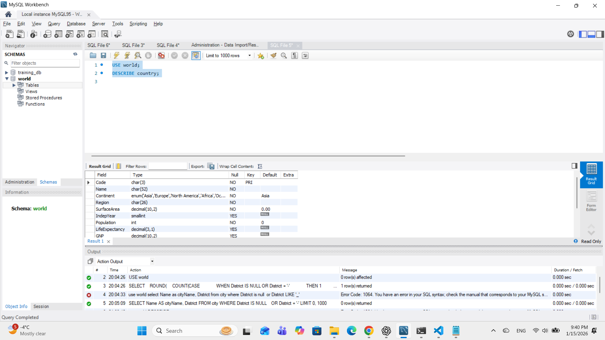
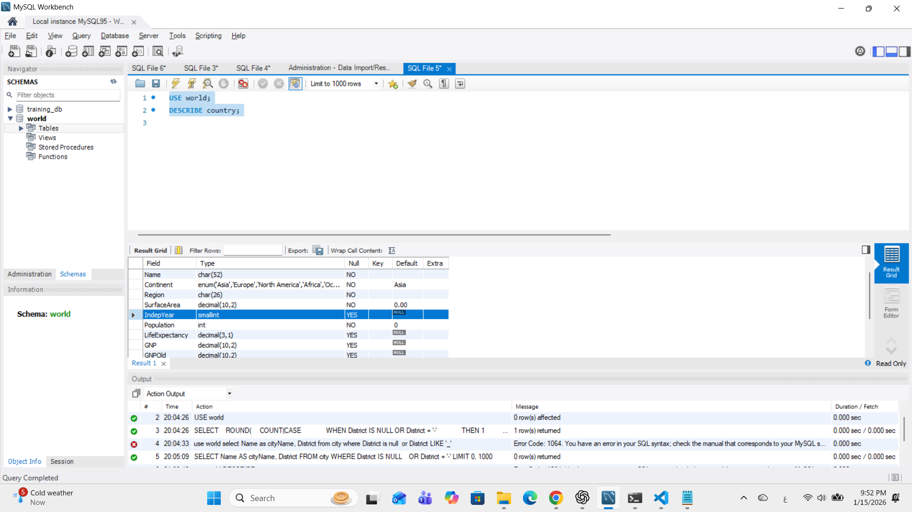
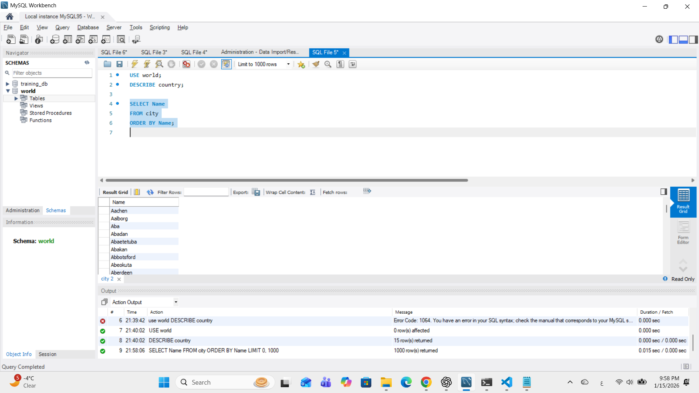
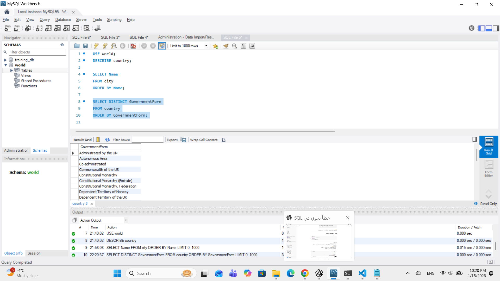
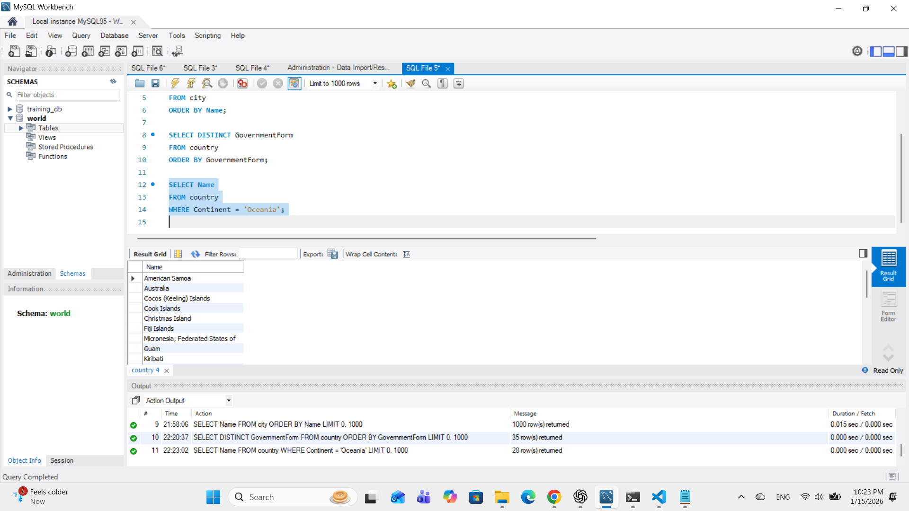
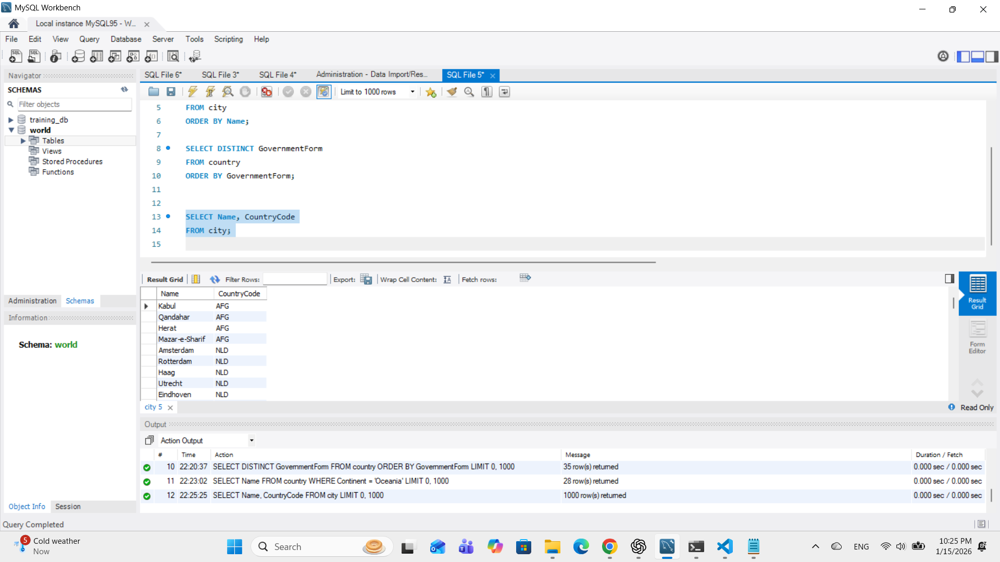
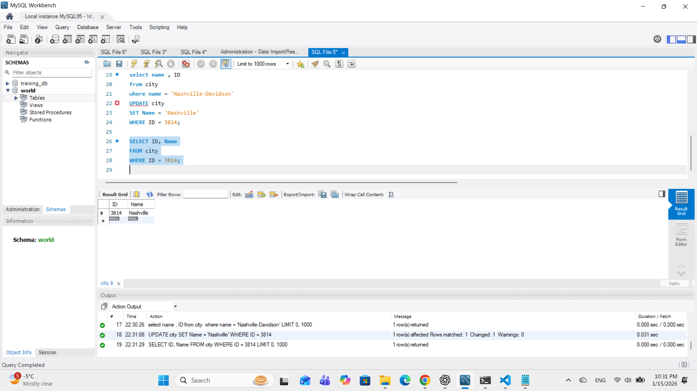
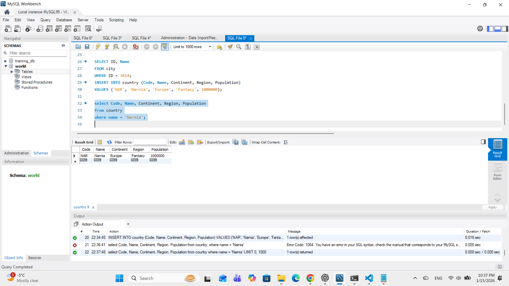
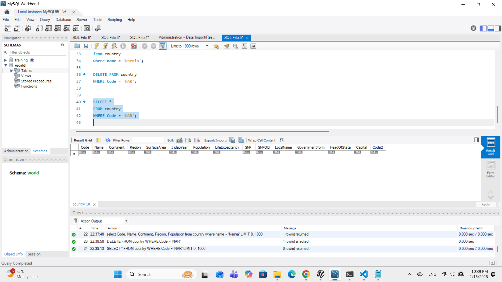

# Exercise 01: World Database SQL Practice

- Name:
- Course: Database for Analytics
- Module: 1
- Database Used: World Database

---

## Instructions

- Answer each question below.
- All SQL commands **must be executed** against the World database.
- For each SQL command:
  - Include the SQL in a fenced code block
  - Include a **screenshot** showing the command and results
- Store screenshots in the `screenshots/` folder and embed them below each answer.

---

## Question 1

**Compare and contrast the data types used for:**
- `country.Population`
- `country.LifeExpectancy`

Why were these data types selected?

### Answer
The `Population` column uses `INT` because population values are whole numbers.  
The `LifeExpectancy` column uses `DECIMAL(3,1)` because it represents measured values that include decimals.  
Each data type matches the nature and precision of the stored data.

### Screenshot
_Show the table structure or DESCRIBE output._

```sql
DESCRIBE country;
```



---

## Question 2

**What is the data type of `country.IndepYear`?**
Why do you think this data type was selected?

### Answer
The data type of `country.IndepYear` is `SMALLINT`.

This data type was selected because `IndepYear` stores years as whole numbers, such as 1776 or 1962. A year does not require decimal values, and `SMALLINT` is sufficient to store year ranges while using less storage than a regular `INT`.

Additionally, `SMALLINT` allows `NULL` values, which is important because some countries do not have an independence year.

### Screenshot

```sql
DESCRIBE country;
```



---

## Question 3

**Make a case for a different data type for `country.IndepYear`.**
Explain why your proposed data type might be better in some situations.

### Answer

A good alternative data type for `country.IndepYear` is `YEAR`.

It can be better because it is specifically designed to store year values, making the column meaning clearer and helping validation (preventing unrealistic values). In databases that support `YEAR` well, it can also simplify year-based queries and improve consistency.

---

## Question 4

Write a SQL command to **list the names of all cities in alphabetical order**.

### SQL

```sql
SELECT Name
FROM city
ORDER BY Name;
```
This query selects the names of all cities from the city table and orders them alphabetically using the ORDER BY Name clause, which sorts text values in ascending (A–Z) order by default.
### Screenshot



---

## Question 5

Write a SQL command to **list all forms of government from the `country` table**, showing **each only once**, sorted alphabetically.

### SQL

```sql
SELECT DISTINCT GovernmentForm
FROM country
ORDER BY GovernmentForm;
```
This query retrieves all unique forms of government from the country table using DISTINCT to remove duplicates and orders them alphabetically with ORDER BY GovernmentForm.
### Screenshot



---

## Question 6

Write a SQL command to **list all countries in the `Oceania` continent**.

### SQL

```sql
SELECT Name
FROM country
WHERE Continent = 'Oceania';
```
This query selects the names of all countries from the country table where the continent is Oceania, using a WHERE clause to filter the results.
### Screenshot



---

## Question 7

Write a SQL command to **list the names and country code of all cities**.

### SQL

```sql
SELECT Name, CountryCode
FROM city;
```
This query lists all cities in the database along with their associated country codes by selecting the Name and CountryCode columns from the city table.
### Screenshot



---

## Question 8

Write a SQL command to **update the city named `"Nashville-Davidson"` to `"Nashville"`**.

### SQL
```sql
-- Find the city ID (primary key)
SELECT ID, Name
FROM city
WHERE Name = 'Nashville-Davidson';

-- Update safely using the primary key
UPDATE city
SET Name = 'Nashville'
WHERE ID = 3814;

-- Verify the update
SELECT ID, Name
FROM city
WHERE ID = 3814;


MySQL Safe Update Mode can block updates that do not use a key column.
I first found the city’s primary key (ID), then updated the row safely using WHERE ID = 3814, and verified the change with a SELECT query.```

### Screenshot



---

## Question 9

Write a SQL command to **insert a new country named `"Narnia"`** with a country code of `"NAR"`.
Use reasonable values for the remaining columns.

### SQL

```sql
INSERT INTO country (Code, Name, Continent, Region, Population)
VALUES ('NAR', 'Narnia', 'Europe', 'Fantasy', 1000000);
```

### Screenshot



---

## Question 10

Write a SQL command to **delete the country with the country code `"NAR"`**.

### SQL

```sql
DELETE FROM country
WHERE Code = 'NAR';
```

### Screenshot


