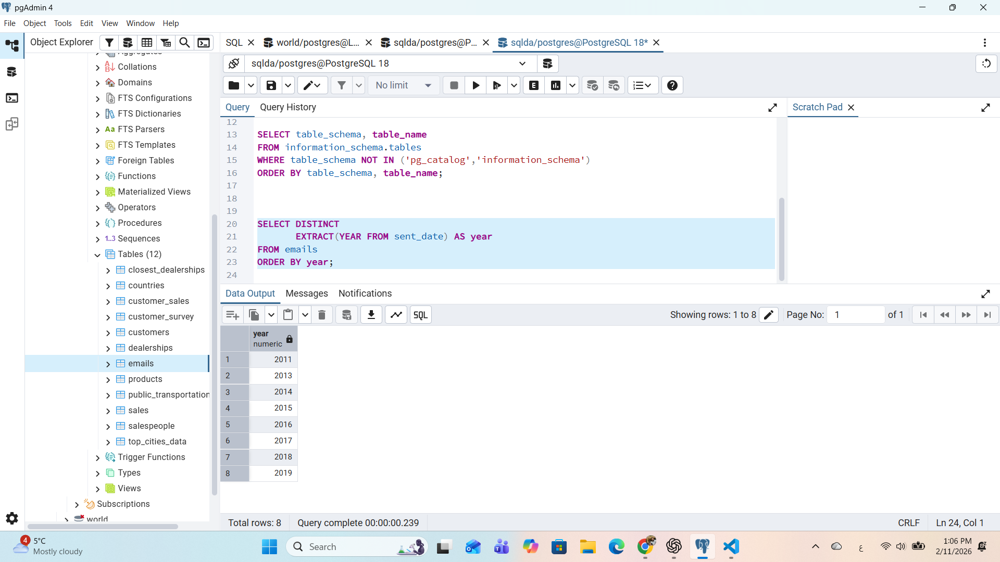
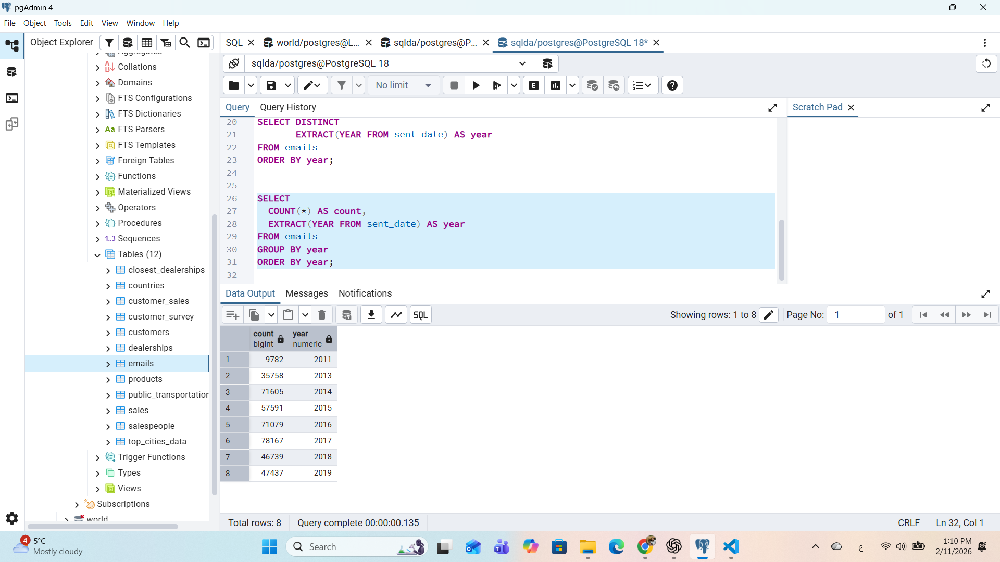
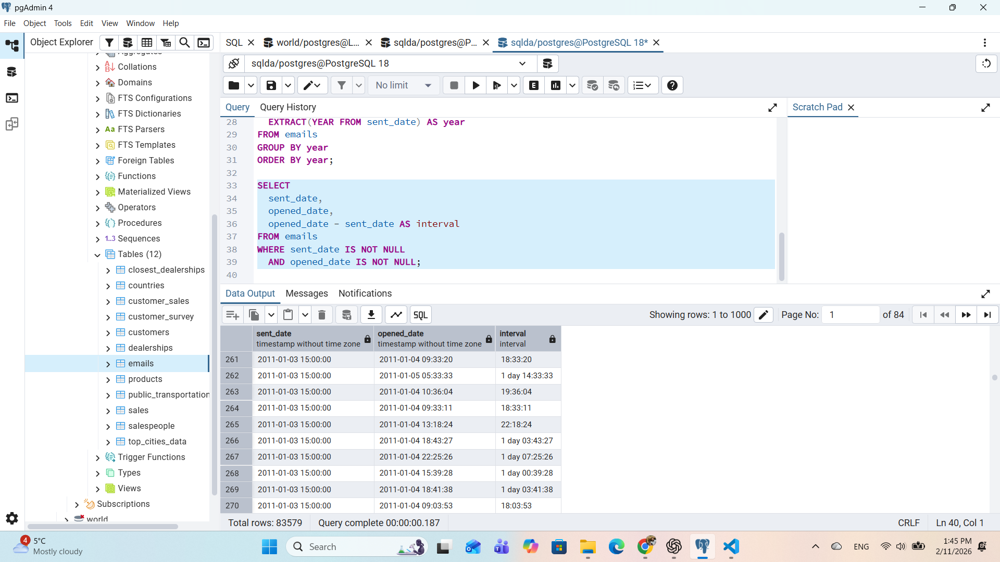
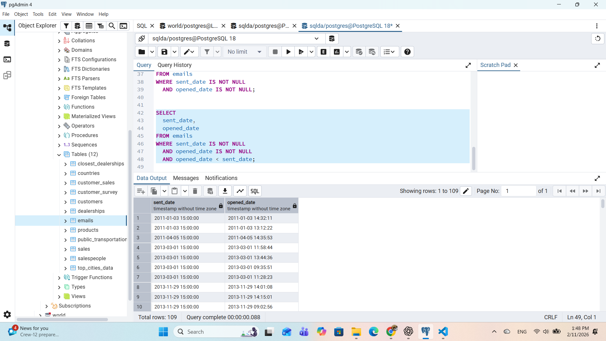
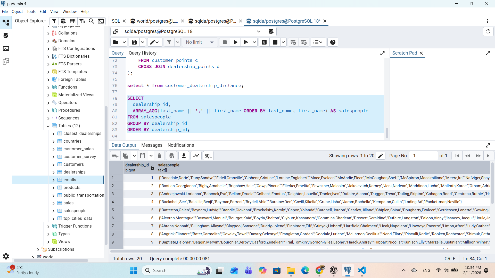
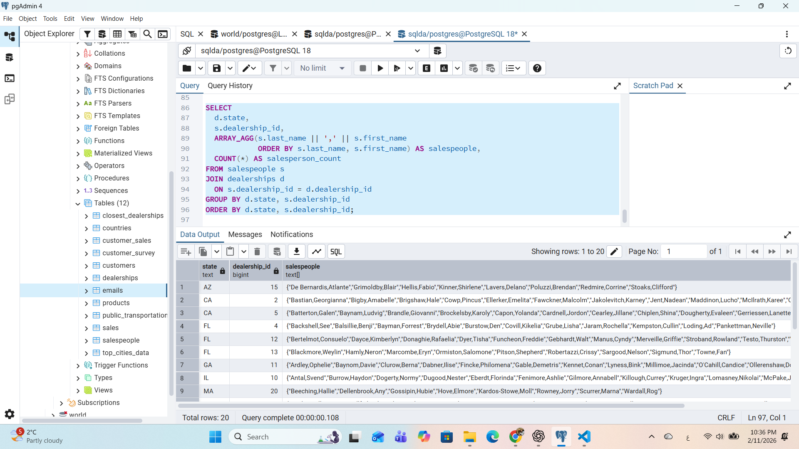
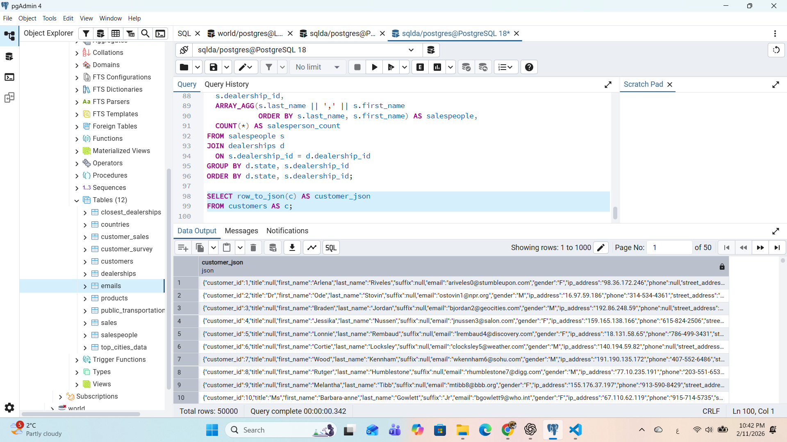
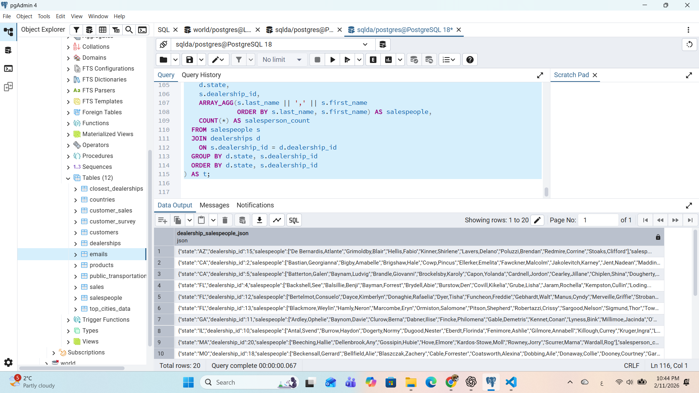

# Exercise 05: SQLDA Database - Dates, Data Quality, Arrays, and JSON

- Name: Sabri Hamdaoui
- Course: Database for Analytics
- Module:
- Database Used:  `sqlda` (Sample Datasets)
- Tools Used: PostgreSQL (pgAdmin or psql)

---

## Instructions

- Use the **sqlda** database from the "Loading the Sample Datasets" instructions.
- For each SQL task:
  - Include your SQL in a fenced code block
  - Execute it and include a **screenshot** showing the query and results
- Store screenshots in the `screenshots/` folder and embed them below each answer.
- For explanation questions:
  - Write your answer in complete sentences
  - Include a screenshot if requested

---

## Question 1

Using the `sqlda` database, write the SQL needed to show a **list of years** that emails were sent.

Your results should list years like this (order matters):

```
year
2011
2013
2014
2015
2016
2017
2018
2019
```

### SQL

```sql
-- SELECT DISTINCT
       EXTRACT(YEAR FROM sent_date) AS year
FROM emails
ORDER BY year;

```

### Screenshot



---

## Question 2

Using the `sqlda` database, write the SQL needed to show the **number of messages sent by year**, ordered by year (as shown in the prompt).

Output should resemble:

```
count   year
...
```

### SQL

```sql
-- SELECT
  COUNT(*) AS count,
  EXTRACT(YEAR FROM sent_date) AS year
FROM emails
GROUP BY year
ORDER BY year;

```

### Screenshot



---

## Question 3

Using the `sqlda` database, write the SQL needed to show:
- the **sent date**
- the **opened date**
- the **interval** between the two

Only include emails that contain **both** a sent date and an opened date.

### SQL

```sql
-- SELECT
  sent_date,
  opened_date,
  opened_date - sent_date AS interval
FROM emails
WHERE sent_date IS NOT NULL
  AND opened_date IS NOT NULL;

```

### Screenshot



---

## Question 4

Using the `sqlda` database, write the SQL needed to show emails that contain an **opened date BEFORE the sent date**.

### SQL

```sql
--
```
SELECT
  sent_date,
  opened_date
FROM emails
WHERE sent_date IS NOT NULL
  AND opened_date IS NOT NULL
  AND opened_date < sent_date;


### Screenshot



---

## Question 5

Using the `sqlda` database: there are **over 100 emails** that contain an opened date **BEFORE** the sent date.

After looking at the data, **why is this the case?**

### Answer

_This issue occurs because the sent_date values are standardized or defaulted to a fixed time (15:00:00), while the opened_date values reflect the actual time an email was opened earlier the same day.

As a result, when an email is opened before 3:00 PM on the same date, the recorded opened_date appears to be earlier than the sent_date, even though the email was not actually opened before it was sent.

This indicates a data modeling and timestamp normalization issue, not a real-world logical error. The dates were likely imported from different systems or processed with inconsistent time assumptions (e.g., batch assignment of sent times versus event-based opened times).

In short, the anomaly is caused by artificial sent times combined with real opened timestamps, leading to misleading comparisons at the time-of-day level.._

### Screenshot (if requested by instructor)


---

## Question 6

Using the `sqlda` database, explain in your own words what the following code does:

```sql
CREATE TEMP TABLE customer_points AS (
    SELECT
        customer_id,
        point(longitude, latitude) AS lng_lat_point
    FROM customers
    WHERE longitude IS NOT NULL
    AND latitude IS NOT NULL
);

CREATE TEMP TABLE dealership_points AS (
    SELECT
        dealership_id,
        point(longitude, latitude) AS lng_lat_point
    FROM dealerships
);

CREATE TEMP TABLE customer_dealership_distance AS (
    SELECT
       customer_id,
       dealership_id,
       c.lng_lat_point <@> d.lng_lat_point AS distance
    FROM customer_points c
    CROSS JOIN dealership_points d
);
```

### Answer

This code creates three temporary tables that are used to calculate the geographic distance between every customer and every dealership using longitude and latitude coordinates.

First, the code creates a temporary table called customer_points. It selects each customer_id from the customers table and converts the customer’s longitude and latitude values into a PostgreSQL point data type named lng_lat_point. Only customers with both longitude and latitude values are included to ensure valid geographic points.

Next, a second temporary table called dealership_points is created. This table does the same conversion for dealerships, storing each dealership_id along with a geographic point built from its longitude and latitude coordinates.

Finally, the code creates a third temporary table called customer_dealership_distance. It performs a CROSS JOIN between all customer points and all dealership points, generating every possible customer–dealership pair. For each pair, the <@> operator calculates the distance between two point values, and the result is stored in a column called distance.

Because these tables are temporary, they exist only for the current database session. Overall, this code prepares spatial data and computes distances to support location-based analysis, such as finding the nearest dealership for each customer.
---

## Question 7

Using the `sqlda` database, write SQL to display an **array of salespeople for each dealership**, sorted by dealership.

For example - dealership 1 is below:

```text
"{""Fidell,Granville"",""Onele,Jereme"",""Sheriff,Lelia"",""McSpirron,Massimiliano"",""Rennick,Nadia"",""Mace,Eveleen"",""Oxteby,Dukie"",""Spong,Marcos"",""Wogden,Quent"",""Duny,Sandye"",""Loraine,Englebert"",""Meere,Ira"",""Gibbens,Cristine"",""Prine,Lyda"",""McCoughan,Sheff"",""Schule,Giselbert"",""McAndie,Eleen"",""Dosedale,Dorie"",""Nafziger,Shay""}"
```

### SQL

```sql
-- SELECT
  dealership_id,
  ARRAY_AGG(last_name || ',' || first_name
            ORDER BY last_name, first_name) AS salespeople
FROM salespeople
GROUP BY dealership_id
ORDER BY dealership_id;

```

### Screenshot



---

## Question 8

Using the `sqlda` database, write SQL to display:
- an **array of salespeople for each dealership**
- the **state** of the dealership
- the **number of salespeople** for the dealership

Sort by **state**.

Reference image:


### SQL

```sql
-- SELECT
  d.state,
  s.dealership_id,
  ARRAY_AGG(s.last_name || ',' || s.first_name
            ORDER BY s.last_name, s.first_name) AS salespeople,
  COUNT(*) AS salesperson_count
FROM salespeople s
JOIN dealerships d
  ON s.dealership_id = d.dealership_id
GROUP BY d.state, s.dealership_id
ORDER BY d.state, s.dealership_id;

```

### Screenshot



---

## Question 9

Using the `sqlda` database, write the SQL needed to convert the **customers** table to **JSON**.

### SQL

```sql
--
SELECT row_to_json(c) AS customer_json
FROM customers AS c;

```

### Screenshot



---

## Question 10

Using the `sqlda` database, write SQL to display:
- an **array of salespeople for each dealership**
- the **state**
- the **number of salespeople**
- sorted by **state**

Then **convert this result to JSON**.

Reference image:


### SQL

```sql
-- SELECT row_to_json(t) AS dealership_salespeople_json
FROM (
  SELECT
    d.state,
    s.dealership_id,
    ARRAY_AGG(s.last_name || ',' || s.first_name
              ORDER BY s.last_name, s.first_name) AS salespeople,
    COUNT(*) AS salesperson_count
  FROM salespeople s
  JOIN dealerships d
    ON s.dealership_id = d.dealership_id
  GROUP BY d.state, s.dealership_id
  ORDER BY d.state, s.dealership_id
) AS t;

```

### Screenshot


